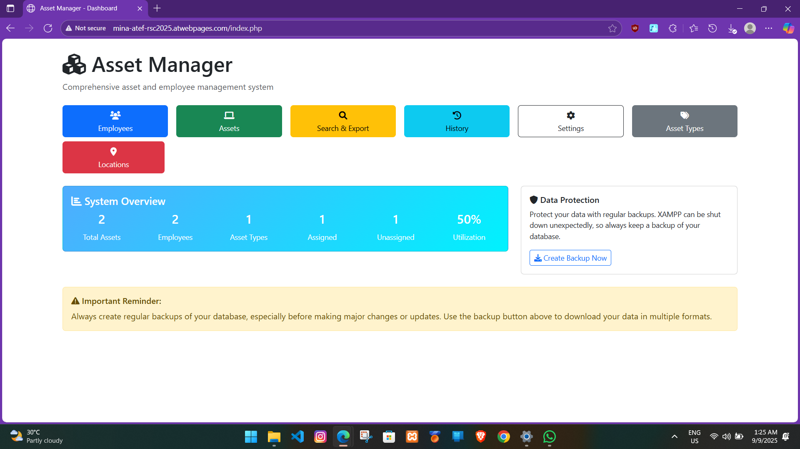

# 🏢 Orascom Assets Manager

## 📌 Project Overview
**Orascom Assets Manager** is a web-based asset management system that I independently developed and manage.  
The platform replaces traditional Excel sheets to efficiently handle all types of assets, create data types, and update records. It has been deployed for **1 year** as a personal project.  

**Website:** [Visit Orascom Assets Manager](http://mina-atef-rsc2025.atwebpages.com/index.php)  
📺
<video width="640" height="360" controls>
  <source src="Asset.mp4" type="video/mp4">
  Your browser does not support the video tag.
</video>
If the video is not working, open it through the image below, which will take you to the Drive link.

---

## 🛠️ Key Features
- Full asset management: add, update, and track different asset types.  
- User-friendly interface with **Bootstrap** for responsive design.  
- Search and filter assets efficiently.  
- Secure authentication to protect data.  
- Independently developed and maintained.  

---

## 📂 Technologies Used
- **Frontend:** HTML, CSS, JavaScript, Bootstrap  
- **Backend:** PHP  
- **Database:** MySQL  
- **Hosting:**  
  - Personal deployment: **AwardSpace**  
  - Orascom deployment: **Windows Server IIS**  

---

## ⚡ Outcomes
- Eliminated manual Excel tracking for assets.  
- Centralized data management for easier updates and reporting.  
- Fully functional deployment for over a year.  

---

## 🔗 Deployment
- Personal hosted site: [http://mina-atef-rsc2025.atwebpages.com/index.php](http://mina-atef-rsc2025.atwebpages.com/index.php)  expired on Sep 2026
- Orascom deployed on **Windows Server IIS**.  

---

## 📑 Notes
- Project independently developed and maintained.  
- Fully operational as a replacement for Excel-based asset management.  
